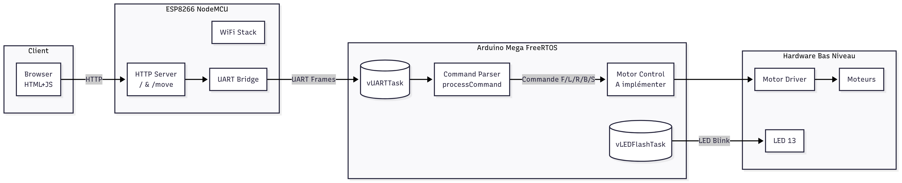

# Robot Control via Arduino Mega + ESP8266 (NodeMCU)

This project demonstrates a simple architecture to control a robot (or any motorized system) through a web interface hosted on an ESP8266 (NodeMCU), which communicates over UART with an Arduino Mega running FreeRTOS.

## Table of Contents
- [Architecture](#architecture)
- [Features](#features)
- [Required Hardware](#required-hardware)
- [Wiring](#wiring)
- [Installation](#installation)
- [How It Works](#how-it-works)
- [Communication Protocol](#communication-protocol)
- [FreeRTOS (Arduino Mega)](#freertos-arduino-mega)
- [Customization](#customization)

- [Author](#author)

---

## Architecture





- The ESP8266 hosts an HTML control page.
- Each user action sends a request like `/move?dir=F`.
- The ESP8266 forwards the direction (`F`, `B`, `L`, `R`, `S`) to the Arduino Mega over UART.
- The Arduino Mega (extendable) can translate these into motor commands.

---

## Features

- Minimal responsive web interface with directional buttons.
- Bidirectional UART bridge (PC ↔ Mega ↔ ESP8266).
- FreeRTOS tasks separating LED heartbeat and UART handling.
- Direction commands: Forward, Backward, Left, Right, Stop.
- Version handling (send `VER` from PC → response: `MEGA_UART_V1.0`).

---

## Required Hardware

| Item | Notes |
|------|-------|
| Arduino Mega 2560 | Main controller |
| ESP8266 NodeMCU | WiFi + web server |
| Dupont wires | RX/TX/GND |
| Motor driver (optional) | L298N / TB6612FNG / etc. |
| Power supply | Appropriate for logic + motors |
| PC (optional) | Serial debugging |

---

## Wiring

| ESP8266 | Arduino Mega |
|---------|--------------|
| TX (GPIO1 / TX0) | RX1 (Pin 19) |
| RX (GPIO3 / RX0) | TX1 (Pin 18) |
| GND | GND |
| 3.3V | 3.3V (stable regulator) |

Important:
- ESP8266 is 3.3V logic. Mega TX (5V) is often tolerated but best practice: use a level shifter or resistor divider for ESP RX.
- Provide a stable 3.3V (≥300 mA peak).

---

## Installation

### 1. Arduino Mega
1. Open `ARDUINO_MEGA_UART_NODEMCU.ino` in Arduino IDE.
2. Ensure FreeRTOS library for Arduino is installed (if not bundled).
3. Select Board: Arduino Mega 2560.
4. Upload.

### 2. ESP8266
1. Open `esp8266_avecmega.ino`.
2. Set your WiFi credentials:
   ```cpp
   const char* ssid = "YOUR_SSID";
   const char* password = "YOUR_PASSWORD";
   ```
3. Select Board: NodeMCU 1.0 (ESP-12E Module).
4. Upload.
5. Open Serial Monitor (115200 baud) to view:
   ```
   WiFi connected
   IP address: 192.168.x.y
   NodeMCU Ready
   ```

### 3. Access the Interface
Open: `http://192.168.x.y/`

---

## How It Works

| Web Action | HTTP Request | UART Sent to Mega |
|------------|--------------|-------------------|
| Forward | /move?dir=F | F |
| Backward | /move?dir=B | B |
| Left | /move?dir=L | L |
| Right | /move?dir=R | R |
| Stop | /move?dir=S | S |

The Mega receives a single character per command and can map it to actual motor control logic (to be implemented by you).

---

## Communication Protocol

Current protocol: extremely minimal.
- Lines terminated by `\r` or `\n`.
- Commands are short (one letter or simple tokens).
- Example:
  ```
  ESP8266 -> Mega: "F\r\n"
  PC -> Mega: "VER\r\n"
  Mega -> PC: "MEGA_UART_V1.0\r\n"
  ```

Suggested future protocol ideas:
- Delimited frames: `CMD:MOVE;DIR:F;SPEED:100`
- JSON (if memory allows): `{"cmd":"move","dir":"F","speed":100}`
- Binary framed packets with checksum for reliability.

---

## FreeRTOS (Arduino Mega)

Tasks:
- `vLEDFlashTask`: Blinks onboard LED every 150 ms (heartbeat).
- `vUARTTask`: Reads from `Serial` (PC) and `Serial1` (ESP8266), assembles lines, processes `VER`.

Improvement opportunities:
- Use a queue to decouple parsing from processing.
- Insert `vTaskDelay(1)` in idle loops to yield CPU.
- Separate command parser into its own module.
- Add watchdog.

---

## Customization

1. Add speed parameter:
   - Frontend: `fetch('/move?dir=F&speed=120')`
   - ESP8266: read `server.arg("speed")`, forward `F,120`
   - Mega: parse `F,120` and apply PWM.

2. Add state feedback:
   - Mega periodically sends: `STATE:OK` or `POS:123,45`
   - ESP8266 adds `/status` route returning latest state
   - Frontend polls with `setInterval`.

3. Add security:
   - Require token: `/move?dir=F&key=SECRET123`
   - Validate before forwarding.
   - Or restrict to local subnet + WPA2.

4. mDNS:
   - Add `#include <ESP8266mDNS.h>` to serve at `http://robot.local/`.

5. Use WebSockets for real-time control:
   - Reduces HTTP overhead for rapid directional updates.

---

## Possible Improvements

| Category | Idea |
|----------|------|
| Reliability | Add framed packets + checksum |
| Security | Token or HMAC-based auth |
| UI | Virtual joystick / keyboard bindings |
| Telemetry | Battery, sensor data panel |
| Networking | mDNS + captive portal for setup |
| Control | Acceleration & smoothing (ramp profiles) |
| Logging | Circular buffer + `/log` endpoint |
| Extendability | Macro scripts (sequence execution) |
| Resilience | Heartbeat ping Mega ↔ ESP, auto-reset if lost |

---


## Author

Created by (Armad / Handle).  
Contributions welcome via pull requests.

---

## Quick File Overview

| File | Purpose |
|------|---------|
| `esp8266_avecmega.ino` | WiFi setup + HTTP server + UART forwarding |
| `ARDUINO_MEGA_UART_NODEMCU.ino` | FreeRTOS tasks + bidirectional UART + basic command handling |

---


---

Happy building!
